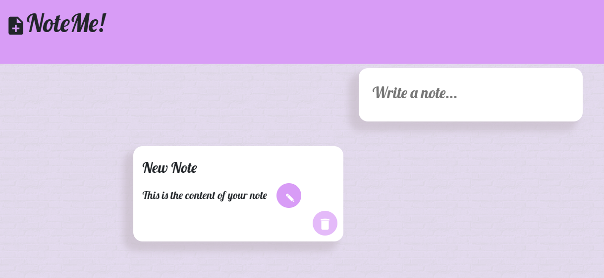

# Note Me

> This is a React.js application that provides the main functions you'd expect from a note app, such a note addition, edition and deletion.

## Table of contents

- [General info](#general-info)
- [Screenshots](#screenshots)
- [Technologies](#technologies)
- [Setup](#setup)
- [Features](#features)
- [Inspiration](#inspiration)

## General info

This application was made to improve React JS skills.

## Screenshots

## Technologies

- JavaScript ES6
- Bootstrap - version 4.0
- React JS - version 16.12.0

## Setup

To run this project install it locally using npm:

- cd.../NoteMe
- npm install
- npm start

Link to application: https://drzasta.github.io/NoteMe/

## Features

- Write title and content of your note and add it using "+" button
- Whenever you want to change your note, edit it by clicking on the ✏️
- Delete your note using 🗑️
- Use it on your computer or phone

## Inspiration

This app is inspired by Angela Yu tutorial (https://www.udemy.com/course/the-complete-web-development-bootcamp/)
